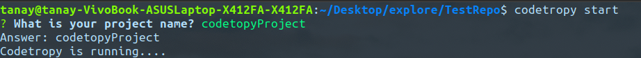
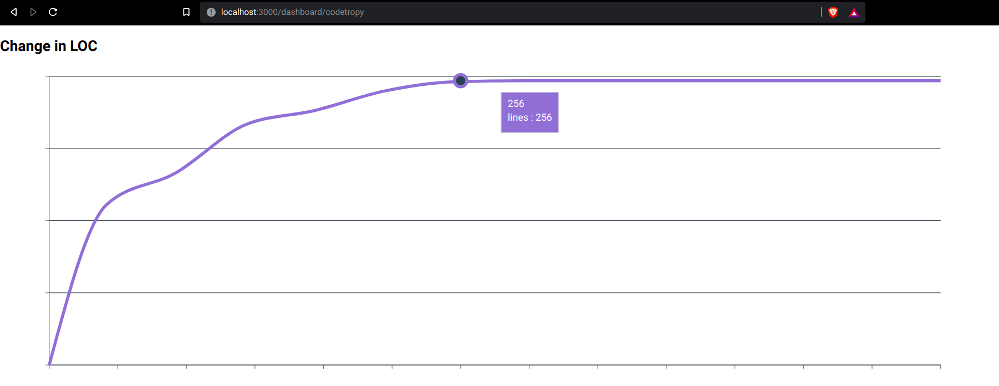

<div id="top"></div>

<!-- [![Contributors][contributors-shield]][contributors-url]
[![Forks][forks-shield]][forks-url]
[![Stargazers][stars-shield]][stars-url]
[![Issues][issues-shield]][issues-url]
[![MIT License][license-shield]][license-url]
[![LinkedIn][linkedin-shield]][linkedin-url] -->

<!-- PROJECT LOGO -->
<br />
<div align="center">
  <a href="https://github.com/tanay13/codetropy">
    
  </a>

  <h3 align="center">Codetropy</h3>

  <p align="center">
    A npm package for watching over your project in order to avoid copying huge chunks of codes in any short format coding competition/hackathons.
    <br />
    ·
    <a href="https://github.com/tanay13/codetropy/issues">Report Bug</a>
    ·
    <a href="https://github.com/tanay13/codetropy/issues">Request Feature</a>
  </p>
</div>

<!-- TABLE OF CONTENTS -->
<details>
  <summary>Table of Contents</summary>
  <ol>
    <li>
      <a href="#about-the-project">About The Project</a>
      <ul>
        <li><a href="#built-with">Built With</a></li>
      </ul>
    </li>
    <li>
      <a href="#getting-started">Getting Started</a>
      <ul>
        <li><a href="#prerequisites">Prerequisites</a></li>
        <li><a href="#installation">Installation</a></li>
      </ul>
    </li>
    <li><a href="#usage">Usage</a></li>
    <li><a href="#roadmap">Roadmap</a></li>
    <li><a href="#contributing">Contributing</a></li>
    <li><a href="#license">License</a></li>
    <li><a href="#contact">Contact</a></li>
    <li><a href="#acknowledgments">Acknowledgments</a></li>
  </ol>
</details>

<!-- ABOUT THE PROJECT -->

## About The Project

[![Product Name Screen Shot][product-screenshot]](https://example.com)

Codetropy is a set of microservice which watches over your project directory and calculates the change in the total as well as the specific file by continuously watching over the addition and deletion of characters within the project directory.

<p align="right">(<a href="#top">back to top</a>)</p>

### Built With

Tools that were used in the process of making this microservice are:

- [Typescript](https://www.typescriptlang.org/)
- [Node.js](https://nodejs.org/en/)
- [Express](https://expressjs.com/)
- [React](<[https://](https://reactjs.org/)>)

<p align="right">(<a href="#top">back to top</a>)</p>

### Components

- [Codetropy](https://github.com/tanay13/codetropy) - A npm package written in typescript which should be downloaded in the project directory. This package will send the changes to the server where the data will be processed accordingly.

- [Codetropy-server](https://github.com/tanay13/codetropy-server) - This is a server for codetropy written in typescript and express framework. Its main usecase is to collect data from the package and store the hashmap in the redis database.
- [Codetropy-dashboard](https://github.com/tanay13/codetropy-dashboard) - A simple front end written in React to display the graphs team/project wise.

<!-- GETTING STARTED -->

## Getting Started

To get a local copy up and running follow these simple steps:

### Prerequisites

This is an example of how to list things you need to use the software and how to install them.

- npm

  ```sh
  npm install npm@latest -g
  ```

### Installation

_Below is an example of how you can instruct your audience on installing and setting up your app. This template doesn't rely on any external dependencies or services._

1. Install the codetropy package locally in the project structure.

   ```sh
   npm install codetropy
   ```

2. Start the codetropy process using the following command
   ```sh
   codetropy start
   ```
3. Enter the team/project name and codetropy will start running

   

4. Go to <b>/dashboard/teamname</b> to get the graph for your project.

<p align="right">(<a href="#top">back to top</a>)</p>

<!-- USAGE EXAMPLES -->

## Usage

After starting the package go to <b>/dashboard/teamname</b> to monitor the change in lines of code.



Following files and folders are ignored by default

- node_modules
- package.json
- package-lock.json
- .git

<p align="right">(<a href="#top">back to top</a>)</p>

<!-- ROADMAP -->

## Roadmap

- [x] Add readme
- [ ] Add support for adding ignored files/folder

See the [open issues](https://github.com/codetropy/issues) for a full list of proposed features (and known issues).

<p align="right">(<a href="#top">back to top</a>)</p>

<!-- CONTRIBUTING -->

## Contributing

Contributions are what make the open source community such an amazing place to learn, inspire, and create. Any contributions you make are **greatly appreciated**.

If you have a suggestion that would make this better, please fork the repo and create a pull request. You can also simply open an issue with the tag "enhancement".
Don't forget to give the project a star! Thanks again!

1. Fork the Project
2. Create your Feature Branch (`git checkout -b feature/AmazingFeature`)
3. Commit your Changes (`git commit -m 'Add some AmazingFeature'`)
4. Push to the Branch (`git push origin feature/AmazingFeature`)
5. Open a Pull Request

<p align="right">(<a href="#top">back to top</a>)</p>

<!-- LICENSE -->

## License

Distributed under the MIT License. See `LICENSE.txt` for more information.

<p align="right">(<a href="#top">back to top</a>)</p>

<!-- CONTACT -->

## Contact

Your Name - [Tanay](https://twitter.com/tanayhere) - tanay.raj76@gmail.com

Project Link: [https://github.com/tanay13/codetropy](https://github.com/tanay13/codetropy)

<p align="right">(<a href="#top">back to top</a>)</p>
